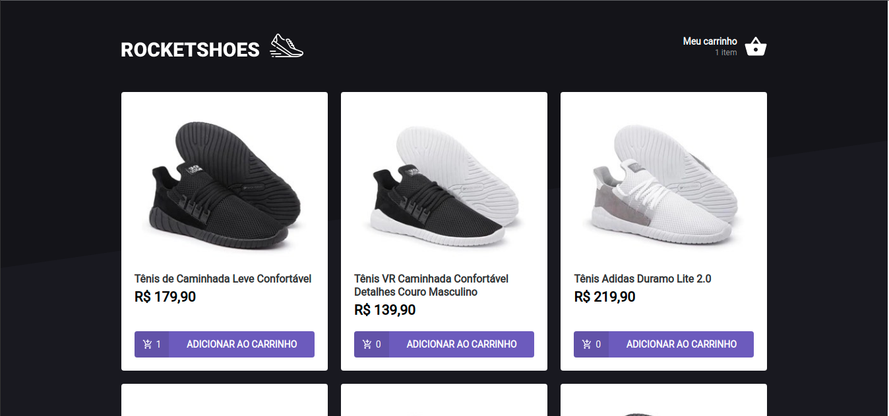
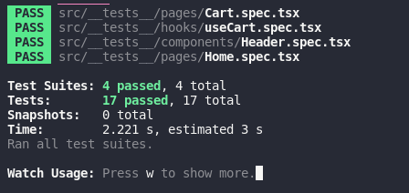

# 🚀 Desafio 01 - Criando um hook de carrinho de compras

Nesse desafio, você deverá criar uma aplicação para treinar o que aprendeu até agora no ReactJS

Essa será uma aplicação onde o seu principal objetivo é criar um hook de carrinho de compras. Você terá acesso a duas páginas, um componente e um hook para implementar as funcionalidades pedidas nesse desafio:

## Funcionalidades

- [x] Adicionar um novo produto ao carrinho;
- [x] Remover um produto do carrinho;
- [x] Alterar a quantidade de um produto no carrinho;
- [x] Cálculo dos preços sub-total e total do carrinho;
- [x] Validação de estoque;
- [x] Exibição de mensagens de erro;
- [x] Entre outros.

## Excecutar local de desenvolvimento 🏠

Clone o projeto

```bash
  git clone https://github.com/pcbrsites/ignite-react-criar-carrinho-compras
```

Vá para diretório do projeto

```bash
  cd ignite-react-criar-carrinho-compras
```

Instale as dependências

```bash
  npm install
  # ou
  yarn install
```

Iniciar o servidor

```bash
  npm run dev
  # ou
  yarn run dev
```

Iniciar o servidor (APU)

```bash
  npm run server
  # ou
  yarn run server
```

### Rodar Teste

```bash
  npm run test
  # ou
  yarn run test
```



## License

[MIT](https://choosealicense.com/licenses/mit/)
